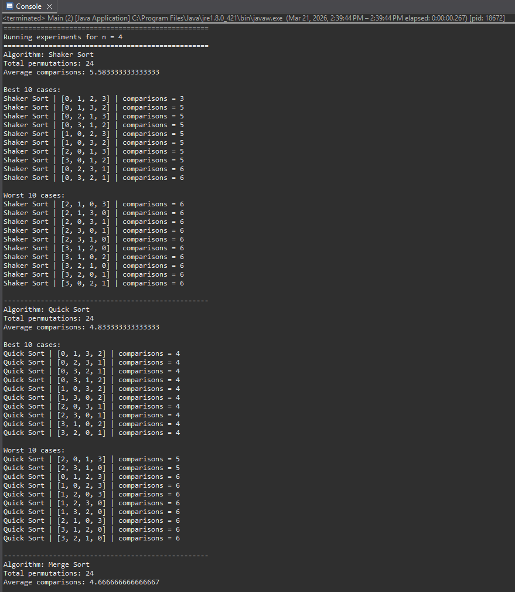

## Verification Results (Naomi - Verification Lead)

The project was successfully built and executed locally.

### Test Execution Summary:
- All sorting algorithms (Shaker, Quick, Merge, Heap) executed without errors
- Experiments ran for input sizes n = 4, 6, and 8
- Output includes:
  - Total permutations
  - Average comparisons
  - Best 10 cases
  - Worst 10 cases

### Observations:
- Comparison counts increase as input size increases
- Quick Sort and Merge Sort generally have lower average comparisons than Heap Sort
- Output formatting is consistent and readable

### Issues Found:
- Initial project setup required configuration of the source folder and JRE
- No algorithm or runtime errors were found after setup

### Conclusion:
The program is functioning correctly and meets the project requirements from a verification standpoint.

### Evidence:

